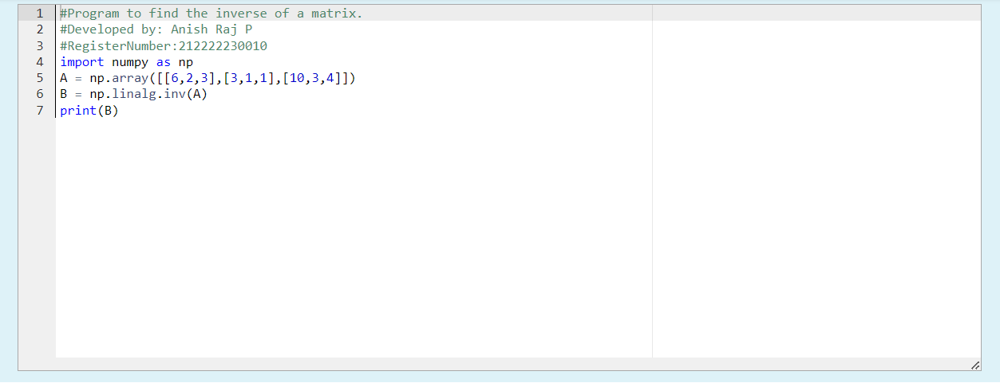

# INVERSE-OF-A-MATRIX
## Aim:
To write a python program to find the inverse of a matrix
## Equipment’s required:
1. 	Hardware – PCs
2. 	Anaconda – Python 3.7 Installation / Moodle-Code Runner
## Algorithm:
### Step1 : 
Import numpy as np
### Step 2: 
List the values in the array
### Step 3: 
Give the linalg command
### Step 4: 
Print the rank and get the output

## Program:
```
#Program to find the inverse of a matrix.
#Developed by: Anish Raj P
#RegisterNumber:212222230010
import numpy as np
A = np.array([[6,2,3],[3,1,1],[10,3,4]])
B = np.linalg.inv(A)
print(B)
```
## Output:



## Result:
Thus the inverse of given matrix is successfully solved using python program

